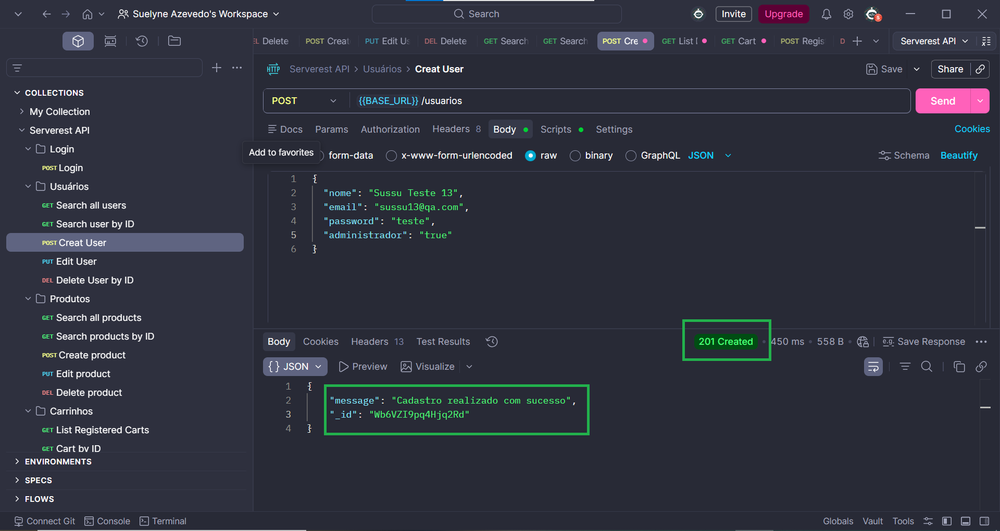
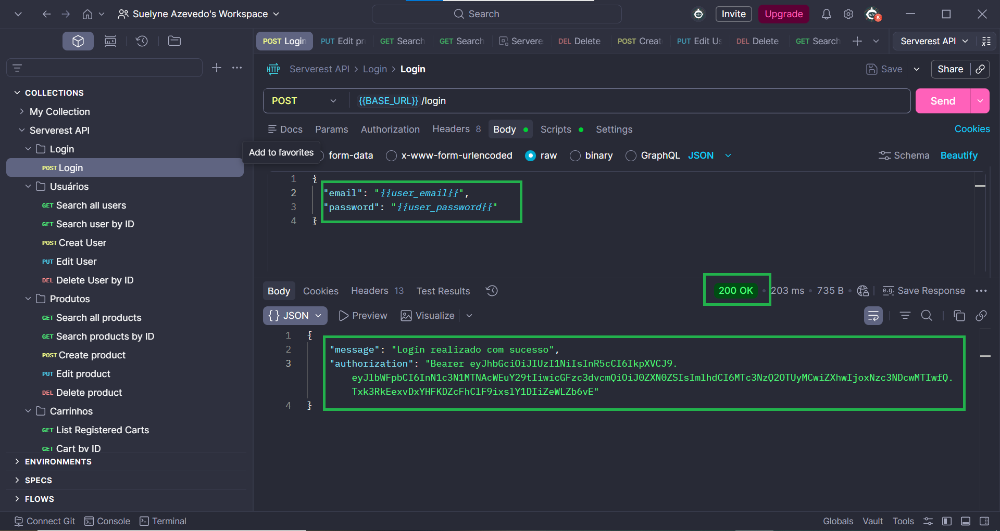
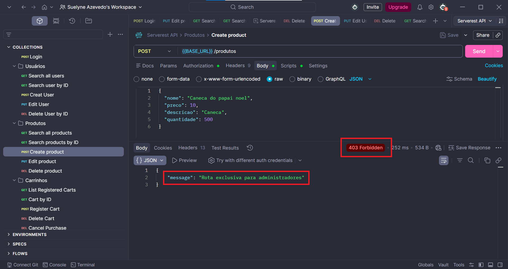
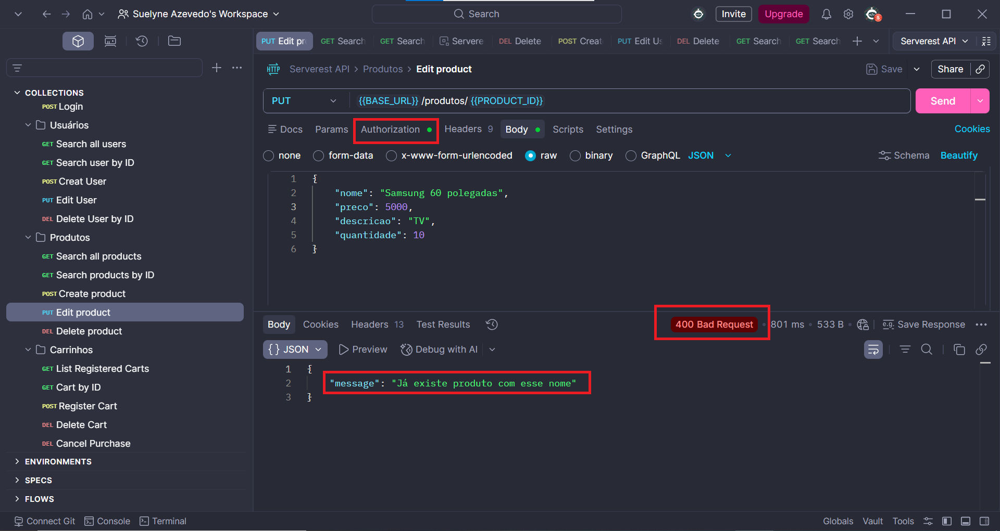
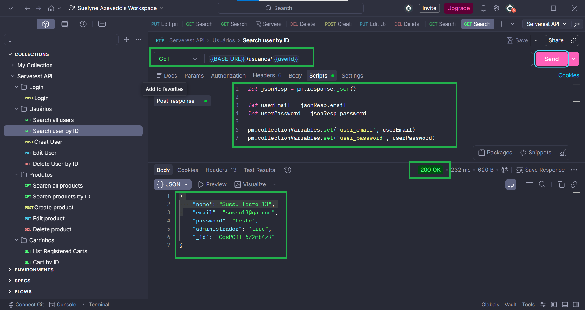

# Serverest API Testing Project

This project contains API tests created using Postman for the Serverest application.  
The goal is to practice and demonstrate core QA skills in API testing, request validation, and test organization.

---

## Project Overview

In this project, I developed and executed API tests covering key functionalities such as:

- User creation
- User search by ID
- Authentication (login)
- Product creation
- Cart management

The tests simulate real-world scenarios and validate API behavior through structured requests and automated scripts.

---

## Tools & Technologies

- Postman (API testing)
- JavaScript (Postman scripts)
- Git & GitHub (version control)

---

## QA Approach

During the development of these tests, I applied a QA mindset by:

- Validating expected vs actual behavior  
- Investigating inconsistent API responses  
- Identifying possible edge cases (e.g., duplicated users, missing data)  
- Ensuring test reliability through proper data handling  

---

## Test Coverage

The collection includes:

- Functional API requests
- Dynamic data handling using variables
- Chained requests (data dependency between endpoints)
- Basic validation of responses

---

## Negative Test Scenarios

- Unauthorized user attempting admin actions
- Requests without authentication token
- Invalid token validation
- Invalid input data (e.g., negative values)
- Non-existent resources (e.g., product ID)

---

## How to Run

1. Import the Postman collection
2. (Optional) Import the environment file
3. Execute requests in sequence:

   - Create User  
   - Search User by ID  
   - Login  
   - Create Product  
   - Add Product to Cart  

---

## Key Learnings

Through this project, I developed practical experience with:

- API request/response analysis  
- Extracting and reusing dynamic data (IDs, emails, etc.)  
- Writing scripts in Postman (Tests tab)  
- Handling dependent requests in a test flow  
- Debugging API issues based on response behavior  

---

## Test Evidence

Below are some examples of API requests and responses executed during the tests:

### Create User

### Login

### Create Product

### Edit Product

### Search User by ID

---

## Test Execution Video
[Watch Video](./video/serverest-api-test-run.mp4)

## 📎 Notes

This project was developed for learning purposes, focusing on building a strong foundation in API testing and QA practices.

---
